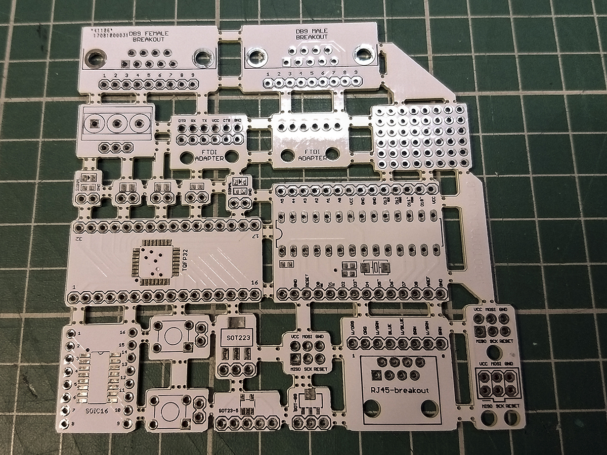
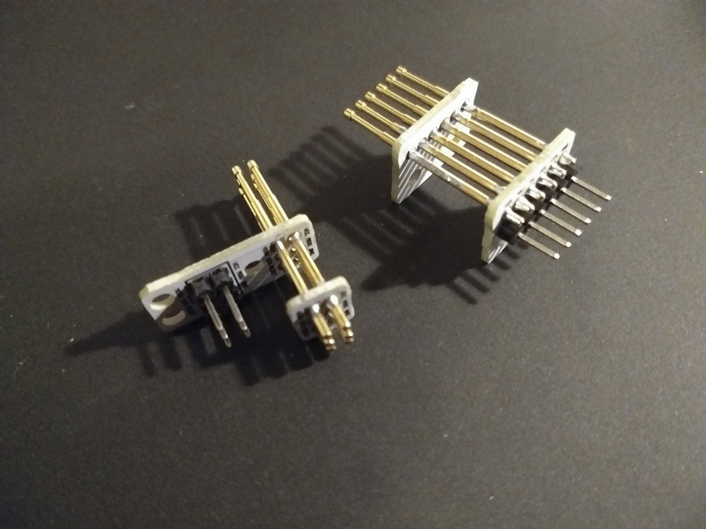
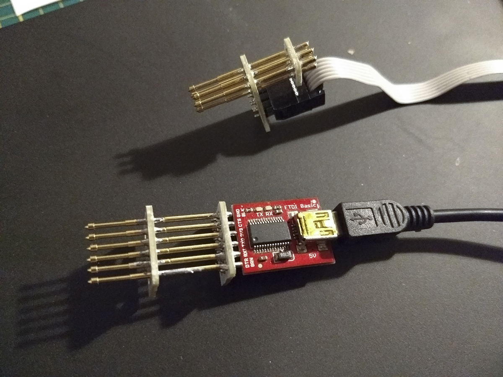

# Breadboarding protopack

Pack of PCB's for (SMD) prototyping, designed in Eagle, geared towards cheap PCB services such as Seeed and Dirty PCBs (no affiliation). 
Target is to create a single pack of very usable proto board on a 10x10cm area.

Order it directly [here](http://dirtypcbs.com/store/designer/details/wjt/5832/protopack-gerbers-1-0-zip) from Dirty PCBs

# Boards included:

SMD breakout boards:
* TQFP32 IC
* SOIC16 / SSOP16 IC
* SOT23 / SOT89 IC
* SOT223 IC
* SOT23-5 IC
* 0805/0603 resistor/capacitor/led (3x)
* 0805 led with 0603 resistor (2x)

Other breakout boards:
* RJ45 breakout board
* DB9 Female breakout board
* DB9 Male breakout board
* 3 pin screw terminal breakout boards
* Momentary pushbutton (2x)
* Minimal 'Arduino'

Pogo pin tools:
* 1x6 FDTI adapter
* 2x3 AVR ICSP programming adapter

A correct Pogo pin for these boards is the P100-E2 1mm pogo pin, available here: http://dirtypcbs.com/store/details/12/dirty-pogo-pins

Other:
* 8x6 island style proto board

# Usage tips:

The boards can be fairly easily broken out of the panel on the holes. This will leave a rough spot, which can easily be trimmed with some sidecutting pliers or with a file or some sandpaper.
